# Microsoft Entra ID Identity Baseline

## Project Overview

This project demonstrates the implementation of a foundational Identity and Access Management (IAM) environment using Microsoft Entra ID.

I created a fictional organization called **KD Identity Solutions** and built an identity baseline that includes internal users, department-based security groups, delegated administrative access, external B2B collaboration, identity lifecycle administration, authentication configuration review, and Microsoft Graph PowerShell reporting.

The goal of this project was to gain hands-on experience with core identity administration concepts before moving into more advanced identity security, hybrid identity, governance, and automation projects.

---

## Environment & Tools

- Microsoft Entra ID
- Microsoft Entra Admin Center
- Microsoft Azure
- Microsoft Graph PowerShell SDK
- PowerShell 7
- macOS workstation
- Microsoft Entra ID Free tenant

---

## Identity Architecture

I created multiple fictional employee identities representing different departments within KD Identity Solutions.

Departments represented in the environment include:

- Human Resources
- Finance
- Sales
- Information Technology
- Operations

Each identity was configured with organizational attributes such as department, job title, company, employee ID, employee type, and usage location.

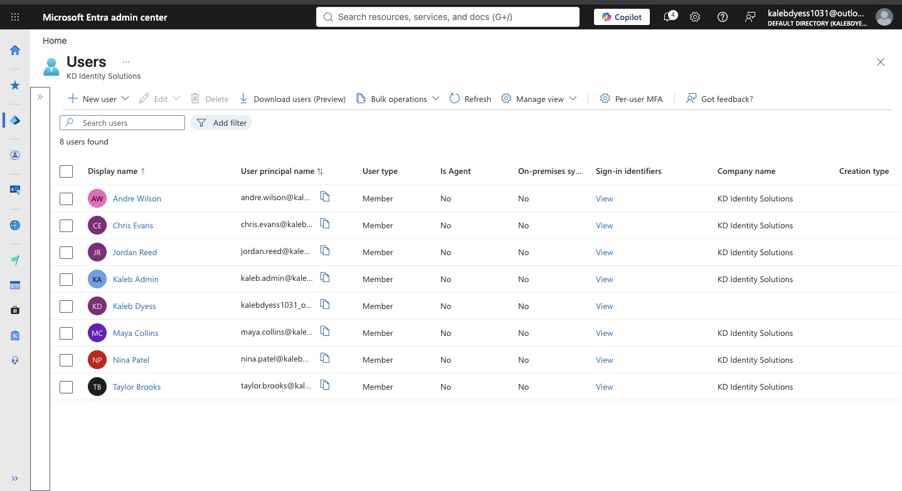

---

## Security Group Design

I created department-based security groups using a consistent naming convention:

- `SG-HR-Employees`
- `SG-Finance-Employees`
- `SG-Sales-Employees`
- `SG-IT-Employees`
- `SG-Operations-Employees`
- `SG-Managers`

Each group was configured as a **Security** group with **Assigned** membership.

Users were placed into groups based on their department and job responsibilities. This provides a foundation for group-based access management and RBAC.

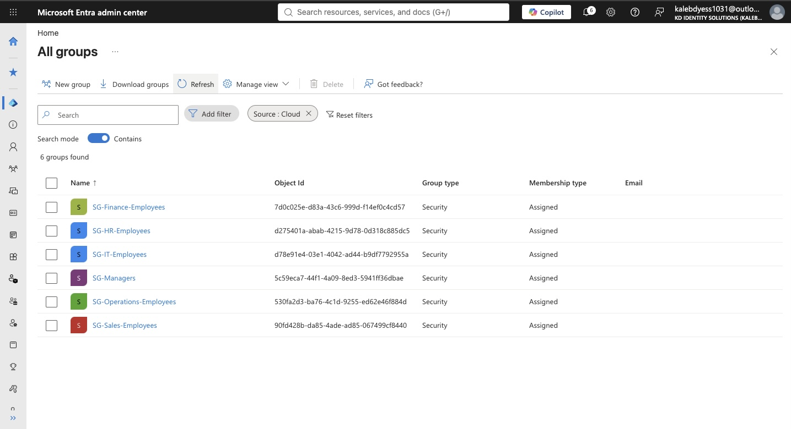

---

## Least-Privilege Administrative Access

Instead of using Global Administrator access for routine identity administration, I created a dedicated administrative identity:

**Kaleb Admin**

The account was assigned the built-in **User Administrator** role.

This allows the administrative account to perform user and group management tasks while reducing unnecessary privileged access.

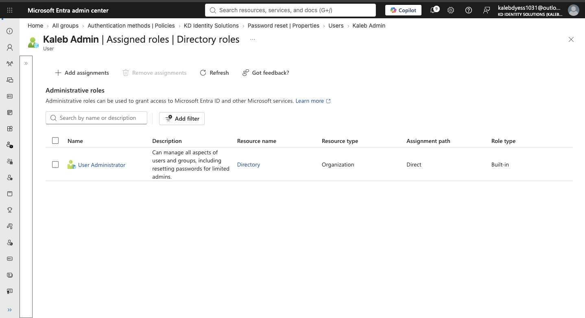

---

## Authentication & Security Baseline

I reviewed the tenant's authentication method policies to understand which authentication methods were currently enabled or disabled.

The authentication methods policy included several configured methods with varying enabled/disabled states, including:

- Passkey (FIDO2)
- Microsoft Authenticator
- Temporary Access Pass
- Software OATH tokens
- Email OTP

I also verified that **Microsoft Security Defaults** were enabled for the tenant.

This project documented the existing authentication baseline rather than treating every displayed authentication method as a configuration change performed during the lab.

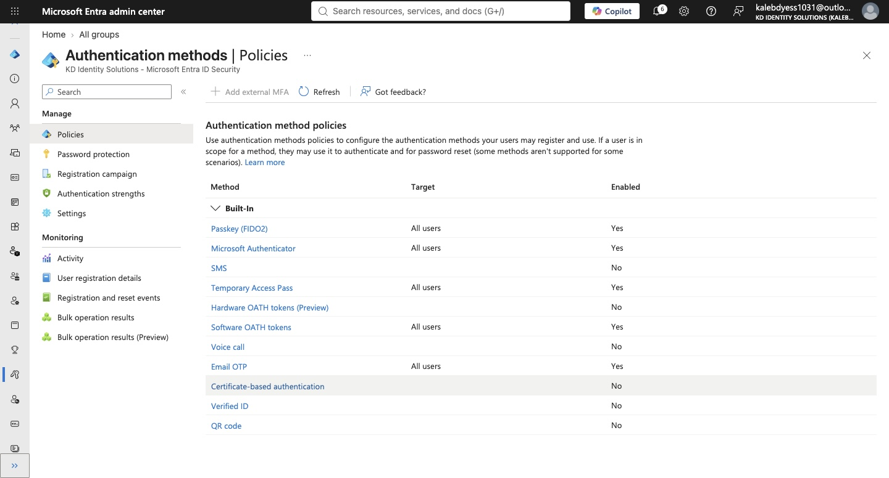

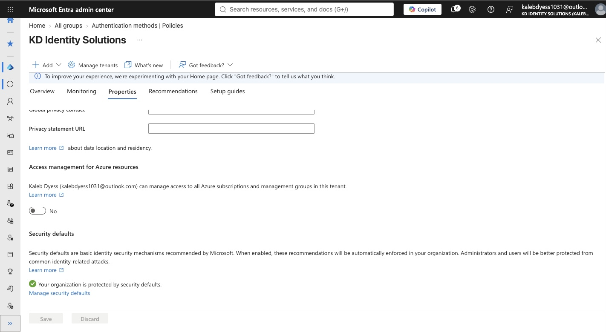

---

## Self-Service Password Reset Review

I reviewed the Self-Service Password Reset (SSPR) configuration available within the tenant.

The SSPR configuration was documented as part of the identity baseline, but full end-user SSPR deployment was not implemented in this lab environment.

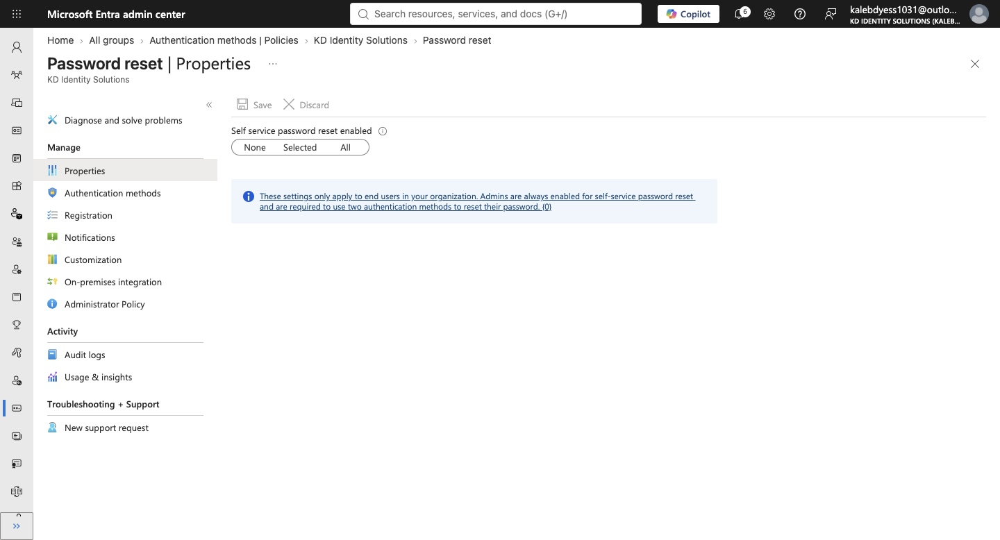

---

## External B2B Collaboration

To simulate collaboration with an external contractor, I invited a controlled external account into the tenant as:

**Olivia Carter — External Security Consultant**

The invitation was successfully redeemed and the identity appeared in Microsoft Entra ID as a **Guest** user.

The guest account was intentionally left with:

- 0 administrative roles
- 0 group memberships
- 0 assigned applications
- 0 assigned licenses

This demonstrated external identity onboarding while maintaining least-privilege access.

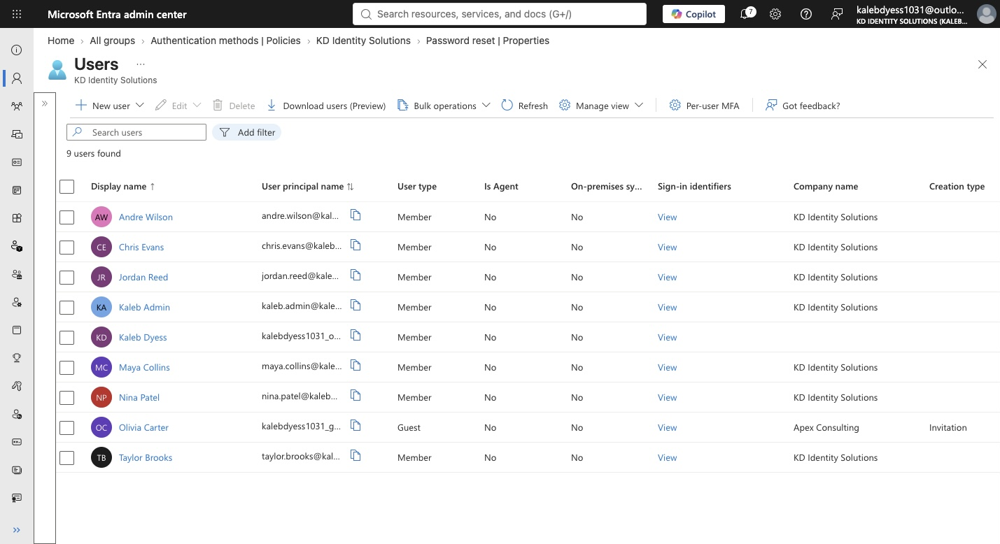

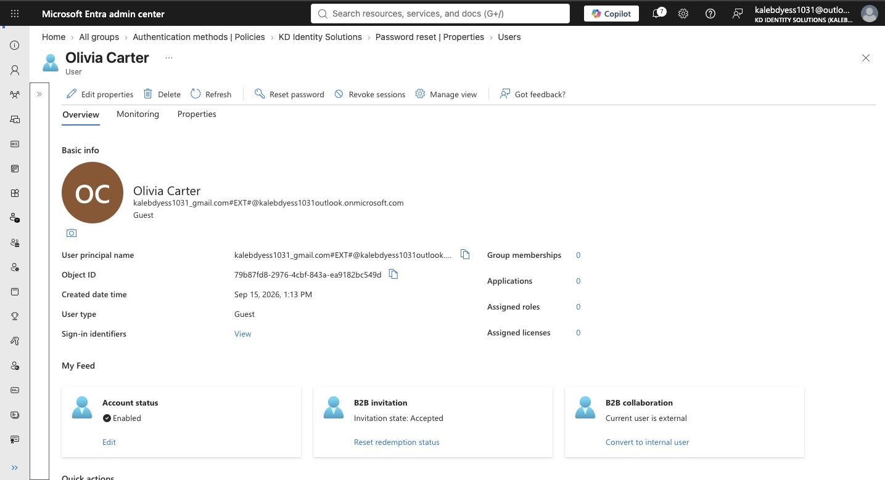

---

## Identity Lifecycle Administration

I simulated an employee lifecycle event using the fictional employee **Andre Wilson**.

The lifecycle test included:

1. Disabling the user account
2. Verifying the disabled account state
3. Re-enabling the account
4. Performing an administrator-initiated password reset

This demonstrated basic identity lifecycle administration for scenarios such as temporary access suspension, account recovery, and employee status changes.

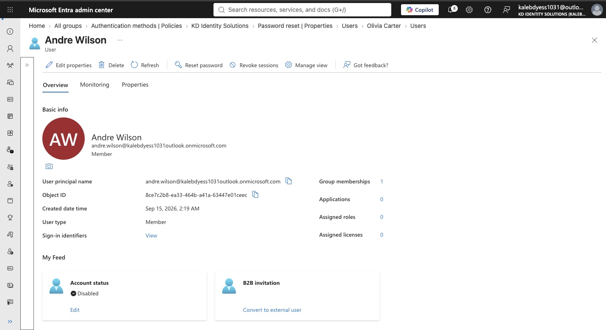

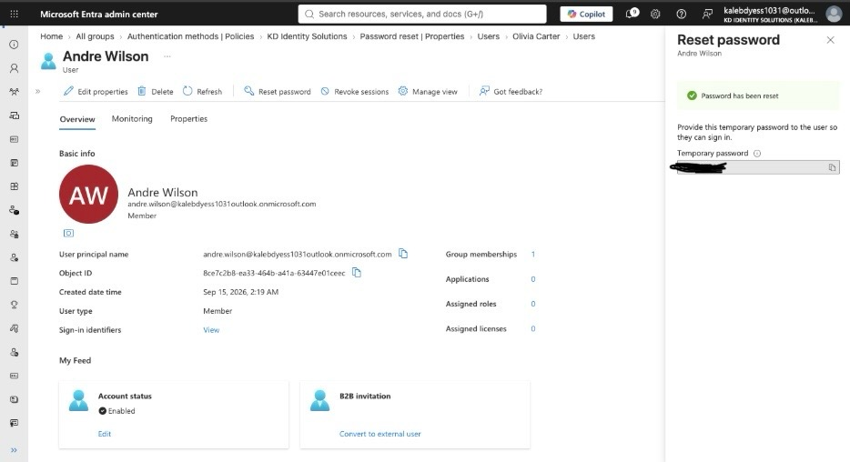

---

## Microsoft Graph PowerShell

I installed PowerShell and the Microsoft Graph PowerShell SDK and authenticated to the Entra tenant using delegated permissions.

The Graph session used the `User.Read.All` permission to perform read-only identity inventory and reporting.

Example user inventory command:

```powershell
Get-MgUser -All -Property "DisplayName","UserPrincipalName","UserType","AccountEnabled" |
Select-Object DisplayName,UserPrincipalName,UserType,AccountEnabled |
Format-Table -AutoSize

```

### Graph User Inventory Results

The following output confirms successful Microsoft Graph authentication and retrieval of identity data from the KD Identity Solutions tenant.

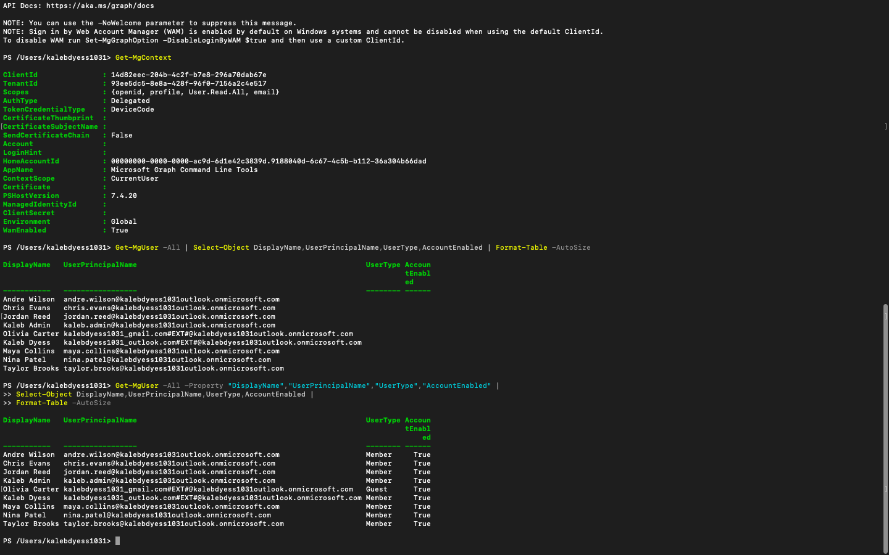
